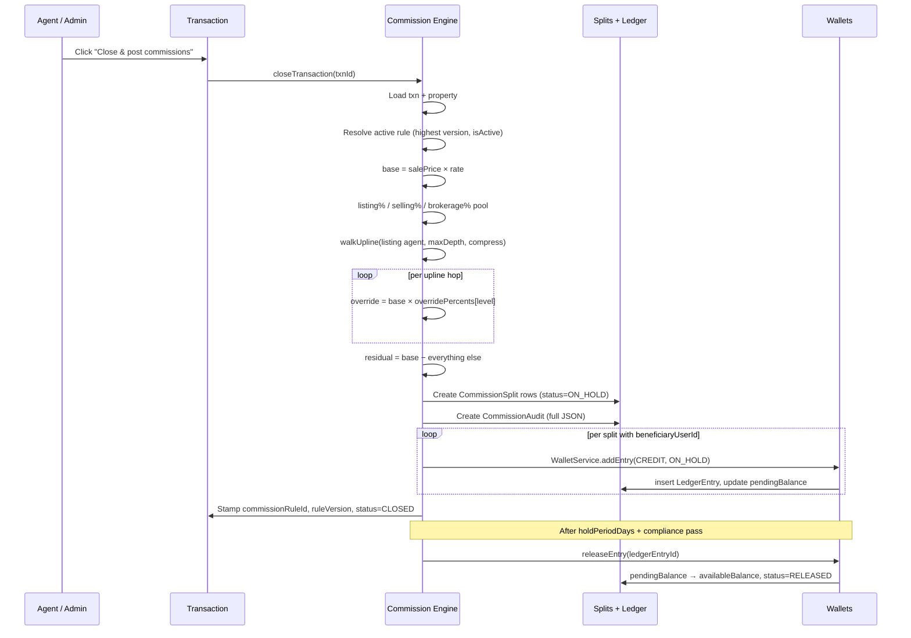

# Real Estate — Commission System Guide

How a closed deal turns into money in agents' wallets, end to end. Read in order
the first time; jump-by-section after that.

> **TL;DR.** When a transaction closes, the engine looks up the active
> `CommissionRule`, computes a *base commission* (a % of sale price), splits it
> into **listing**, **selling**, **override** (paid up the parent chain), and
> **brokerage** shares, persists each share as a `CommissionSplit`, and posts
> a credit to each agent's wallet (status `ON_HOLD`). After the rule's hold
> period and a compliance check, an `ON_HOLD` entry flips to `RELEASED` and the
> agent can withdraw it.

---

## 1. The two hierarchies — and which one pays

`AgentProfile` carries **two** self-referential trees, and the most common
question is "which one drives commissions?" — they have very different jobs.

| Field | Relation | Meaning | Used for |
|---|---|---|---|
| `sponsorId` | `AgentSponsor` | "Who recruited this agent?" | Recruitment metrics, joining bonus reports, the "Sponsor tree" view |
| `parentId` | `AgentParent` | "Which upline node receives this agent's overrides?" | **Commission overrides — `walkUpline()` walks this chain** |

> **Important.** Sponsor and parent are usually the same person, but they are
> *not required to be*. An admin can re-place an agent under a different
> parent for compensation purposes (e.g. reassigning a recruit when their
> recruiter goes on leave) without rewriting the recruitment history. The
> sponsor tree is what HR cares about; the parent tree is what payroll cares
> about.

The other hierarchy views in the UI (`/real-estate/agents/binary`,
`/real-estate/agents/sponsor`, `/real-estate/agents/hierarchy-list`,
`/real-estate/agents/tree`) are all just *visualizations* — different ways of
laying out the same underlying `parentId` / `sponsorId` data:

| View | What it draws | Read from |
|---|---|---|
| Tree (`/agents/tree`) | Pan-zoom canvas of the parent tree | `parentId` |
| Hierarchy: List | Depth-indented spreadsheet | `parentId` |
| Hierarchy: Binary | Left-slot / right-slot view | `parentId` (first child = left, second = right) |
| Hierarchy: Sponsor | Sponsor-edge tree | `sponsorId` |

Only the parent tree feeds the commission engine.

```
parent tree (commissions)         sponsor tree (recruitment)
────────────────────────          ────────────────────────────
   Agent 1  (MD)                    Agent 1
     ↓ parentId                      ↓ sponsorId
   Agent 2  (Senior)                Agent 2
     ↓                               ↓
   Agent 3  (Associate)             Agent 3
```

---

## 2. Commission rule — the rate card

A `CommissionRule` row is the brokerage's standing rate card. Multiple rules
coexist (versioned by `version`); the engine picks the highest `version` with
`isActive = true` for the property's type at calc time.

Key fields:

| Field | Type | What it does |
|---|---|---|
| `listingAgentPercent` | Decimal(7,4) | Cut for the agent who listed the property |
| `sellingAgentPercent` | Decimal(7,4) | Cut for the agent who closed it (often same person, see §3) |
| `brokeragePercent` | Decimal(7,4) | Cut for the house — overrides come **out of this** |
| `overridePercents` | `Decimal[]` (JSON) | Ladder applied top-down to the listing agent's parent chain |
| `useRankOverrides` | bool | If `true`, use the upline agent's **rank's** ladder instead of the rule's |
| `maxOverrideDepth` | int | How many parent hops to walk |
| `defaultBasePercent` | Decimal | Fallback % of sale price if the property doesn't override |
| `holdPeriodDays` | int | How long credits stay `ON_HOLD` before release |
| `compressionRule` | bool | If `true`, skip `SUSPENDED` / `TERMINATED` upline nodes when walking |

**Validity invariant** — the engine asserts
`listingAgentPercent + sellingAgentPercent + brokeragePercent === 100`
before anything happens. If a rule violates this it's a config error, not a
runtime bug — the seed validates it explicitly.

**Active rule from the seed** (`prisma/seed-real-estate.sql`, version 2):

```
listingAgentPercent  = 30%
sellingAgentPercent  = 30%
brokeragePercent     = 40%        ← overrides come out of this
overridePercents     = [5, 3, 1]  ← 5% L1, 3% L2, 1% L3
useRankOverrides     = false
maxOverrideDepth     = 3
defaultBasePercent   = 2          ← of sale price, when property is silent
holdPeriodDays       = 7
compressionRule      = true
```

Version 1 (`listing 25 / selling 25 / brokerage 50`, overrides `[4, 2]`) still
exists in the DB but is `isActive = false` — you'll see it on transactions
that closed before v2 was promoted (see §6 on rule versioning).

---

## 3. Computing the base commission

The base commission is the **first** number we compute — everything else is a
percentage of it.

```
base =
  if property.commissionTermType = 'PERCENTAGE'
     → salePrice × property.commissionPercentage
  if property.commissionTermType = 'FLAT_FEE'
     → property.commissionFlatFee
  else (property has no override)
     → salePrice × rule.defaultBasePercent
```

The property's terms always win when set. That's the broker's escape valve for
deals where the listing was negotiated at a non-standard rate (e.g. friends-and-family,
distress sale).

Inside the engine:

```ts
// lib/real-estate/commission-engine.ts
const base =
  property.commissionTermType === "FLAT_FEE"
    ? new Decimal(property.commissionFlatFee)
    : property.commissionTermType === "PERCENTAGE"
      ? salePrice.times(new Decimal(property.commissionPercentage).div(100))
      : salePrice.times(new Decimal(rule.defaultBasePercent).div(100));
```

The result is rounded **HALF_EVEN** to 2 decimal places (banker's rounding) so
totals reconcile penny-perfect; we'll see why in §5.

---

## 4. Walking the parent chain (`walkUpline`)

This is the core of the MLM mechanic. From the **listing agent's** parent
upward, `maxOverrideDepth` hops, optionally skipping inactive nodes.

```ts
// lib/real-estate/commission-engine.ts (118–162, abridged)
async function walkUpline(tx, listingAgentUserId, maxDepth, compress) {
  const start = await tx.agentProfile.findUnique({
    where: { userId: listingAgentUserId },
    select: { id: true, parentId: true },
  });
  let cursor = start.parentId;          // start at parent, not self
  const out = [];
  while (cursor && out.length < maxDepth) {
    const node = await tx.agentProfile.findUnique({
      where: { id: cursor },
      include: { rank: { select: { overridePercents: true } } },
    });
    const skip = compress && (node.status === "SUSPENDED" || node.status === "TERMINATED");
    if (!skip) out.push(node);          // collect this hop
    cursor = node.parentId;             // climb regardless of skip
  }
  return out;
}
```

Two subtleties:

1. **The walk starts at the parent**, not at the listing agent themselves.
   The agent gets their own listing/selling cut up front; overrides are *paid
   to upline*.
2. **Compression skips but doesn't stop.** A SUSPENDED node is bypassed in the
   payout loop but the walk still climbs through them — so an active
   grandparent above a suspended parent still receives an L1 override (not L2).
   This is BR-8 in the brokerage rulebook: ranks shouldn't suffer because
   their downline is currently inactive.

Why "from the listing agent" and not "from the buyer agent"? Because the
listing agent is the one who originated the deal — their upline carries the
opportunity cost of having mentored them. The selling agent's upline doesn't
get overrides on this deal; they'll earn theirs when *their* downline lists.
This is configurable via the rule, but it's the default convention.

---

## 5. Splits and the brokerage residual

After the walk, the engine assembles up to **N + 3 splits**:

| # | Role | Amount | Beneficiary |
|---|---|---|---|
| 1 | `LISTING_AGENT` | `base × listingAgentPercent` | Listing agent |
| 2 | `SELLING_AGENT` | `base × sellingAgentPercent` | Selling agent (often same person — they get **both** rows) |
| 3..N+2 | `OVERRIDE` | `base × overridePercents[level]` | Each upline hop, level = 1, 2, 3, … |
| N+3 | `BROKERAGE` | residual = base − everything above | Org (house), no user |

The brokerage row is computed last as the **residual**:

```
brokerageResidual = base − sum(all other split amounts)
```

This is intentional. We don't compute brokerage as `base × brokeragePercent`
and hope the rounding works out — we let listing/selling/overrides round
independently and absorb the ±penny rounding leftover into the brokerage row.
That way the splits *always* sum to base, exactly, no matter how many decimal
places `Decimal.HALF_EVEN` shaves off (FR-5.9).

> The brokerage row gets a `CommissionSplit` record but **no `LedgerEntry`** —
> the brokerage isn't a wallet. House cash is tracked in the splits register
> only.

---

## 6. Rule versioning (BR-9)

When a transaction closes, two columns get stamped on the `Transaction` row:

```
commissionRuleId      = ruleId at calc time
commissionRuleVersion = ruleVersion at calc time
```

This is the freeze. If a year from now the brokerage drops the listing cut
from 30% to 25%, **closed deals don't reopen**. The split rows still reference
the old rule, the audit row still has the old snapshot, the wallet credits
already posted, and the rule version on the transaction is the proof of
which rate card applied.

The `CommissionAudit` row goes one step further and stores the **full
calculation result as JSON** — every input, every intermediate value, every
output. That's what disputes are settled with.

---

## 7. The ledger — `ON_HOLD` → `RELEASED`

Every split with a beneficiary user gets a matching `LedgerEntry` with
`status = ON_HOLD`. The amount lands in `Wallet.pendingBalance`, **not**
`availableBalance` — agents can see it but can't withdraw it yet.

```
Wallet.pendingBalance   ← ON_HOLD entries
Wallet.availableBalance ← RELEASED entries (withdrawable)
```

After `holdPeriodDays` and a compliance check (`ComplianceDocument.status =
COMPLIANT`, agent not `TERMINATED`), the release job runs:

```
For each ON_HOLD split older than holdPeriodDays:
  if beneficiary is COMPLIANT and not TERMINATED:
    move amount from pendingBalance → availableBalance
    flip LedgerEntry.status to RELEASED
    flip CommissionSplit.status to RELEASED
```

Reversals (e.g. a deal falls through after the cooling period) post an
**offsetting** `LedgerEntry` referencing `reversesEntryId` rather than mutating
the original — the ledger is append-only.

---

## 8. End-to-end dataflow



---

## 9. Worked example — `TXN-SEED-001`

The seed ships with a fully-instrumented example. Numbers below are exact —
copy them into the engine, you'll get the same splits.

**Setup**

```
Property : PROP-ANDH-001 (Andheri 3 BHK)
  listingPrice           ₹2,50,00,000
  commissionTermType     PERCENTAGE
  commissionPercentage   2%

Transaction : TXN-SEED-001
  salePrice              ₹2,45,00,000     (closed below ask)
  listingAgentId         User 3 (Arjun)
  sellingAgentId         User 2 (Priya)

Parent chain (the one that matters for overrides):
  Agent 3 (Arjun, Associate)
   └ parent → Agent 2 (Priya, Senior)
      └ parent → Agent 1 (MD)
        (no parent — root)

Active rule v2:
  listing 30 / selling 30 / brokerage 40
  overrides [5, 3, 1], maxDepth 3, compress true
```

**Calculation**

```
base = ₹2,45,00,000 × 2% = ₹4,90,000

LISTING_AGENT  = base × 30% = ₹1,47,000  →  User 3 (Arjun)
SELLING_AGENT  = base × 30% = ₹1,47,000  →  User 2 (Priya)

walkUpline(Arjun, depth=3, compress=true):
  L1 → Agent 2 (Priya, ACTIVE)        → override = base × 5% = ₹24,500
  L2 → Agent 1 (MD, ACTIVE)           → override = base × 3% = ₹14,700
  L3 → null (Agent 1 has no parent)   → walk ends

OVERRIDE L1     = ₹24,500             →  User 2 (Priya)
OVERRIDE L2     = ₹14,700             →  User 1 (MD)

BROKERAGE residual = 4,90,000 − 1,47,000 − 1,47,000 − 24,500 − 14,700
                   = ₹1,56,800        →  Org (no wallet)
```

**Splits register (5 rows)**

| # | Role | Level | Beneficiary | Amount | Status |
|---|---|---|---|---:|---|
| 1 | `LISTING_AGENT` | – | User 3 (Arjun) | ₹1,47,000 | `ON_HOLD` |
| 2 | `SELLING_AGENT` | – | User 2 (Priya) | ₹1,47,000 | `ON_HOLD` |
| 3 | `OVERRIDE` | 1 | User 2 (Priya) | ₹24,500 | `ON_HOLD` |
| 4 | `OVERRIDE` | 2 | User 1 (MD) | ₹14,700 | `ON_HOLD` |
| 5 | `BROKERAGE` | – | (none — house) | ₹1,56,800 | `ON_HOLD` |

**Wallet credits posted (4 ledger entries — the brokerage row has no entry)**

| Wallet | Total credit (this txn) | Why |
|---|---:|---|
| Arjun | ₹1,47,000 | listing only |
| Priya | ₹1,71,500 | selling ₹1,47,000 + L1 override ₹24,500 |
| MD | ₹14,700 | L2 override only |
| Org (house) | ₹1,56,800 | residual — tracked in splits, not ledger |

Sum check: `1,47,000 + 1,71,500 + 14,700 + 1,56,800 = ₹4,90,000` ✓

After 7 days (`holdPeriodDays`) and a compliance check, each `ON_HOLD` row
flips to `RELEASED`, and the same amount moves from `pendingBalance` to
`availableBalance` on each wallet.

---

## 10. Variations you'll see in practice

A few transactions in the seed deliberately exercise edge cases — useful to
understand what the engine does with non-default shapes.

### Single principal-broker deal — no overrides
**`TXN-SEED-002`** (BKC office, ₹11.5 cr, listing & selling = User 1 / MD)

The MD has no parent, so `walkUpline` returns an empty array. There are no
override rows. Brokerage residual is just `40%` of base, exactly. The MD is
listed twice (LISTING_AGENT + SELLING_AGENT), so they collect both 30% rows in
their wallet.

### Same agent both ends + one upline override
**`TXN-SEED-003`** (Bandra 2 BHK, ₹3.1 cr, listing & selling = User 2 / Priya)

Priya's parent is User 1. The walk emits one L1 override of 5% to User 1.
Priya gets *both* listing and selling at 30% each — 60% of base — plus zero
override (her own upline override goes to her parent, not her). User 1 gets
the 5% override.

### Inactive node in the chain (compression demo)
If you suspend Agent 2 (`UPDATE re_agent_profiles SET status = 'SUSPENDED' …`)
and re-close TXN-SEED-001 with `compressionRule = true`:

```
walkUpline(Arjun):
  L1 → Agent 2 (SUSPENDED) → SKIPPED, but climb continues
  L1 → Agent 1 (ACTIVE)    → override = 5% (L1 ladder slot)
  L2 → null                → walk ends
```

The MD picks up the L1 slot (5%) instead of the L2 slot (3%). Compression
*moves up* the ladder, doesn't *insert empties*.

If `compressionRule = false`, Agent 2 still gets the override — they paid
their dues, the brokerage will deduct it from her *next* payout if she's
terminated, not from the active deal.

### Property with a flat fee
If a property has `commissionTermType = FLAT_FEE` (say ₹5,00,000), `base` is
literally that flat fee — sale price is ignored. Splits are computed off the
flat amount, identical math from there.

---

## 11. Where the code lives

| Concern | File | Lines |
|---|---|---|
| Engine entry — `calculateCommission` | `lib/real-estate/commission-engine.ts` | 194–334 |
| Parent walk — `walkUpline` | `lib/real-estate/commission-engine.ts` | 118–162 |
| Close + persist — `closeTransaction` | `lib/real-estate/commission-engine.ts` | 349–485 |
| Hold release — `releaseDueCommissions` | `lib/real-estate/commission-engine.ts` | 590–637 |
| Wallet posting — `WalletService.addEntry` | `lib/real-estate/wallet-service.ts` | 47–143 |
| `CommissionRule` model | `prisma/schema.prisma` | 2990–3038 |
| `CommissionSplit` model | `prisma/schema.prisma` | 3057–3088 |
| `LedgerEntry` model | `prisma/schema.prisma` | 3179–3214 |
| `AgentProfile` (parent + sponsor trees) | `prisma/schema.prisma` | 2645–2704 |
| Seed rules (v1, v2) | `prisma/seed-real-estate.sql` | 200–222 |
| Seed transactions | `prisma/seed-real-estate.sql` | 1015–1038 |

---

## 12. Cheat sheet

| Question | Answer |
|---|---|
| Which hierarchy pays overrides? | `parentId` chain (not sponsor) |
| Where do overrides come from? | The brokerage's share, not the listing/selling agents |
| Do overrides start from the agent? | No — start from their parent (you don't earn override on yourself) |
| What happens if a parent is suspended? | If `compressionRule=true`, skip them and the *next* parent gets that ladder slot |
| Can I change rates retroactively? | No — closed transactions are stamped with their rule version |
| Why are credits `ON_HOLD` at first? | Hold period (default 7 days) + compliance check before release |
| Where does the residual penny go? | Brokerage row absorbs it so splits sum to base exactly |
| Does the brokerage get a wallet entry? | No — splits register only, no `LedgerEntry` |
| Is the same agent on both sides allowed? | Yes — they get both `LISTING_AGENT` and `SELLING_AGENT` rows |
| What if there's no active rule? | Calc throws — config error, not a runtime fallback |
