# Real Estate Brokerage Module — Complete End-to-End Guide

> **Audience:** Engineers, product owners, QA, and brokerage admins who need to understand the Real Estate Brokerage Management (REBM) module top to bottom.
> **Scope:** Every page, every API, every engine — Phase 1 (foundation), Phase 2 (finance), and Phase 3 (compliance / reports / rank promotion), plus the modern Excel-style UI.
> **Source of truth:** [`prisma/schema.prisma`](../prisma/schema.prisma), [`lib/api-handlers/real-estate-*.ts`](../lib/api-handlers/), [`lib/real-estate/*`](../lib/real-estate/) services, the [`app/real-estate/*`](../app/real-estate/) UI tree, and the seed at [`prisma/seed-real-estate.sql`](../prisma/seed-real-estate.sql).

---

## Table of Contents

1.  [What the Module Is](#1-what-the-module-is)
2.  [High-Level Architecture](#2-high-level-architecture)
3.  [Data Model](#3-data-model)
4.  [Workflow 1 — Property Lifecycle](#4-workflow-1--property-lifecycle)
5.  [Workflow 2 — Agent Onboarding & MLM Tree](#5-workflow-2--agent-onboarding--mlm-tree)
6.  [Workflow 3 — Lead → Viewing → Conversion](#6-workflow-3--lead--viewing--conversion)
7.  [Workflow 4 — Transaction Close & Commission Engine](#7-workflow-4--transaction-close--commission-engine)
8.  [Workflow 5 — Wallets, Ledger & Payouts](#8-workflow-5--wallets-ledger--payouts)
9.  [Workflow 6 — Compliance Verification](#9-workflow-6--compliance-verification)
10. [Workflow 7 — Rank Promotion Engine](#10-workflow-7--rank-promotion-engine)
11. [Reports & Analytics](#11-reports--analytics)
12. [UI Architecture (Workspace, Excel Table, Tree, ⌘K)](#12-ui-architecture)
13. [Setup, Seeding & Sidebar Install](#13-setup-seeding--sidebar-install)
14. [Demo Walkthrough](#14-demo-walkthrough)
15. [File Inventory](#15-file-inventory)
16. [Glossary](#16-glossary)

---

## 1. What the Module Is

The Real Estate Brokerage module turns the ERP into a full-featured brokerage back-office. It manages five things:

1. **Inventory** — properties for sale or rent.
2. **Network** — agents arranged in an MLM tree (sponsor + parent edges).
3. **Pipeline** — leads, viewings, and conversion to buyers.
4. **Money** — transactions, commission splits, wallets, and payouts.
5. **Trust** — KYC compliance, license tracking, rank promotion, and full audit trails.

It is multi-tenant (every row carries `organizationId`) and lives entirely under `/real-estate/*` URLs and `/api/real-estate/*` API routes. The MLM engine is the highest-stakes piece: it computes commission splits with `Decimal`-safe arithmetic and an append-only ledger so balances are always reconcilable.

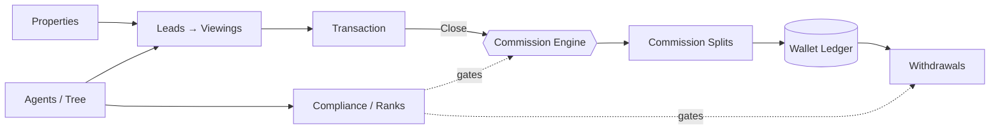

---

## 2. High-Level Architecture

### 2.1 Layers

| Layer            | Where                                                        | What it does                                            |
| ---------------- | ------------------------------------------------------------ | ------------------------------------------------------- |
| **Schema**       | [`prisma/schema.prisma`](../prisma/schema.prisma)            | All REBM tables prefixed `re_*`                         |
| **Services**     | [`lib/real-estate/*`](../lib/real-estate/)                   | Pure-logic engines — no HTTP. Commission, wallet, compliance, ranks, reports |
| **Handlers**     | [`lib/api-handlers/real-estate-*.ts`](../lib/api-handlers/)  | Auth + validation + service calls + JSON serialisation  |
| **API routes**   | [`app/api/real-estate/**/route.ts`](../app/api/real-estate/) | Thin shells that delegate to handlers                   |
| **Client API**   | [`lib/api/real-estate/*.ts`](../lib/api/real-estate/)        | RTK Query endpoints + tag types + TS types              |
| **Pages**        | [`app/real-estate/**/page.tsx`](../app/real-estate/)         | UI                                                      |
| **Workspace UI** | [`components/real-estate/workspace/*`](../components/real-estate/workspace/) | Shared list/detail shell, Excel data table, palette, tree node |
| **Constants**    | [`components/real-estate/constants.ts`](../components/real-estate/constants.ts) | Status labels, badge variants, formatters             |

### 2.2 Request flow (typical)

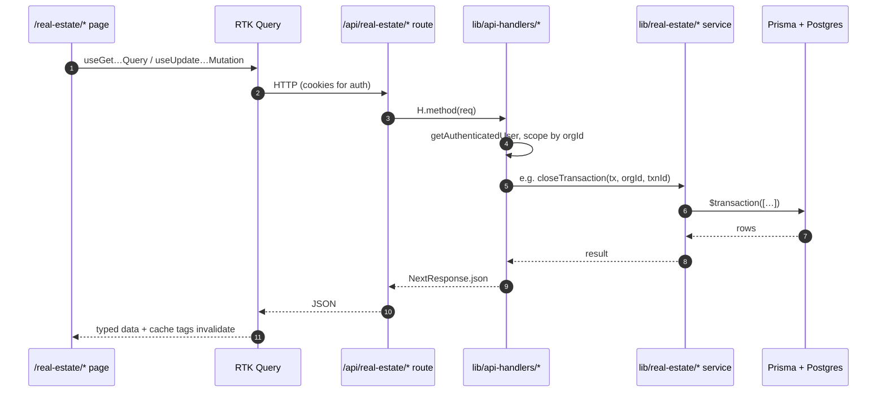

### 2.3 Tenancy & permissions

- Every read query `WHERE organizationId = req.user.organizationId` (no exceptions).
- Mutations check `isUserAdmin(userId, orgId)` for admin-only actions (compliance verification, rank promotion, withdrawal approval, sidebar install).
- The `re_compliance_documents` audit field `verified_by_id` is mandatory and references `users.id` for traceability.

---

## 3. Data Model

### 3.1 Core entities (Phase 1)

```
re_properties ─┬─< re_property_images
               ├─< re_property_documents
               ├─< re_property_price_history
               ├─< re_property_viewings
               └─< re_transactions

users ──── re_agent_profiles ─┬─< re_agent_profiles (sponsor / parent self-ref)
                              ├─< re_compliance_documents
                              └─< re_rank_promotions

re_ranks ─────< re_agent_profiles

re_leads ─┬─< re_lead_activities
          ├─< re_property_viewings
          └─── re_buyers (via convert-to-buyer)
```

### 3.2 Finance entities (Phase 2)

```
re_transactions ─┬─< re_transaction_documents
                 ├─< re_commission_splits ─< re_ledger_entries
                 └─< re_commission_audits

re_commission_rules ─< re_transactions      (rule-version stamping per BR-9)

users ── re_wallets ─┬─< re_ledger_entries  (append-only)
                     ├─< re_bank_accounts   (AES-256-GCM encrypted)
                     └─< re_withdrawal_requests
```

### 3.3 Status enums at a glance

| Entity              | Statuses                                                                       |
| ------------------- | ------------------------------------------------------------------------------ |
| `Property`          | `DRAFT` / `AVAILABLE` / `UNDER_CONTRACT` / `SOLD` / `WITHDRAWN` / `EXPIRED`    |
| `Agent`             | `PENDING_KYC` / `ACTIVE` / `SUSPENDED` / `TERMINATED`                          |
| `Agent compliance`  | `COMPLIANT` / `PENDING_KYC` / `NON_COMPLIANT`                                  |
| `Lead`              | `NEW` → `CONTACTED` → `QUALIFIED` → `VIEWING_SCHEDULED` → `NEGOTIATING` → `CONVERTED` / `LOST` |
| `Viewing`           | `SCHEDULED` / `COMPLETED` / `CANCELLED` / `NO_SHOW`                            |
| `Transaction`       | `PENDING` / `CLOSED` / `CANCELLED` / `DISPUTED`                                |
| `Commission split`  | `ON_HOLD` / `RELEASED` / `REVERSED`                                            |
| `Ledger entry`      | `ON_HOLD` / `RELEASED` / `REVERSED`                                            |
| `Withdrawal`        | `REQUESTED` → `APPROVED` → `PROCESSING` → `PAID` (or `REJECTED` / `FAILED` / `CANCELLED`) |
| `Compliance doc`    | `PENDING` / `VERIFIED` / `REJECTED` / `EXPIRED`                                |

### 3.4 Decimal columns

All money lives in `Decimal(14, 2)` columns: `re_properties.listing_price`, `re_transactions.sale_price` / `base_commission`, every `re_commission_splits.amount`, every `re_ledger_entries.amount` / `balance_after`, every wallet aggregate. The commission engine uses `Prisma.Decimal` end-to-end with `HALF_EVEN` rounding (FR-5.8).

---

## 4. Workflow 1 — Property Lifecycle

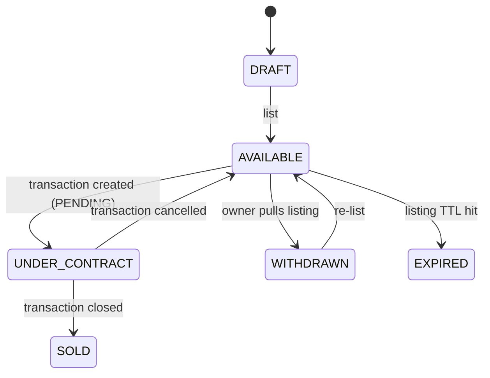

**Key rules**

- `listing_price` changes write a row in `re_property_price_history` and require a `priceChangeReason` on the update payload — that's why inline-edit on the list page only lets you change `status`, not `price`.
- `primaryImageUrl` is a denormalised pointer to whichever `re_property_images` row has `is_primary=true`. The handler keeps these in sync.
- A property can have at most one in-flight `PENDING` transaction at a time. The transaction handler enforces this on create.

**Where it lives**

- Handler: [`lib/api-handlers/real-estate-properties.ts`](../lib/api-handlers/real-estate-properties.ts)
- Pages: [`/real-estate/properties`](../app/real-estate/properties/), `/real-estate/properties/new`, `/real-estate/properties/[id]`, `/real-estate/properties/[id]/edit`
- Form component: [`components/real-estate/property-form.tsx`](../components/real-estate/property-form.tsx)

---

## 5. Workflow 2 — Agent Onboarding & MLM Tree

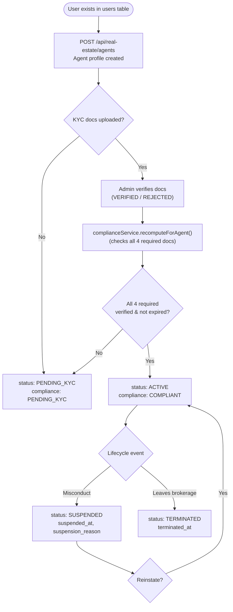

### 5.1 The MLM tree

Every agent has two optional self-referential edges:

- `sponsor_id` — who recruited them (drives override commission walk)
- `parent_id`  — who manages them organisationally (drives reporting)

In practice they are usually the same agent, but the schema separates them so a "sponsor moves on, manager stays" reorg doesn't rewrite history.

The agent-tree page renders this as an interactive pan/zoom canvas — see [§12.4](#124-agent-tree-canvas).

### 5.2 Required compliance documents (BR-7)

```
GOVERNMENT_ID         (Aadhaar/passport)
REAL_ESTATE_LICENSE   (RERA)
TAX_FORM              (PAN)
AGENCY_AGREEMENT      (signed by both parties)
```

`complianceService.recomputeForAgent()` is the single source of truth that decides whether an agent is `COMPLIANT`. It walks `re_compliance_documents` filtered by these four types and demands every one be `VERIFIED` and not past `expiry_date`.

### 5.3 Cycle prevention (BR-10)

Re-parenting an agent is the only operation that can introduce a cycle in the tree. The handler runs `isDescendantOf(newParentId, agentId)` first — if `agentId` is anywhere under the proposed new parent, the API returns 400. This is checked transactionally so concurrent reparents can't sneak past it.

**Where it lives**

- Handler: [`lib/api-handlers/real-estate-agents.ts`](../lib/api-handlers/real-estate-agents.ts)
- Service: [`lib/real-estate/compliance-service.ts`](../lib/real-estate/compliance-service.ts), [`lib/real-estate/rank-promotion-service.ts`](../lib/real-estate/rank-promotion-service.ts)
- Tree UI: [`app/real-estate/agents/tree/page.tsx`](../app/real-estate/agents/tree/page.tsx)

---

## 6. Workflow 3 — Lead → Viewing → Conversion

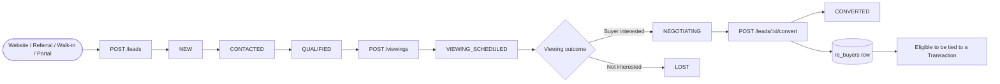

### 6.1 Auto-status advancement

When you log a `LeadActivity` of type `VIEWING` while the lead is in `NEW`/`CONTACTED`/`QUALIFIED`, the handler advances it to `VIEWING_SCHEDULED`. This avoids the inconsistency of "lead has 3 viewings but status says NEW". Set is hard-coded as `earlyStages = new Set(["NEW", "CONTACTED", "QUALIFIED"])` in [`lib/api-handlers/real-estate-leads.ts`](../lib/api-handlers/real-estate-leads.ts).

### 6.2 Conversion writes two rows atomically

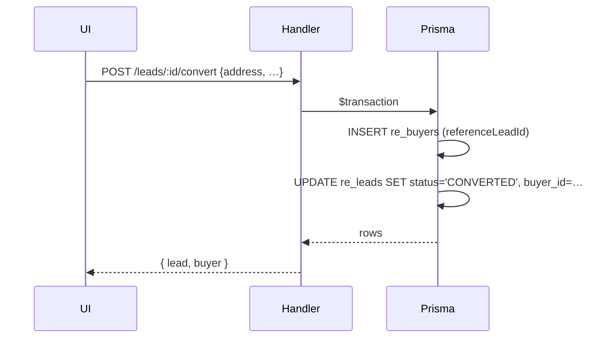

A failed transaction leaves both rows untouched — the lead won't be marked `CONVERTED` if the buyer write fails.

**Where it lives**

- Handler: [`lib/api-handlers/real-estate-leads.ts`](../lib/api-handlers/real-estate-leads.ts)
- Pages: `/real-estate/leads` (list + Kanban toggle), `/real-estate/leads/[id]`, `/real-estate/viewings`

---

## 7. Workflow 4 — Transaction Close & Commission Engine

This is the most consequential workflow in the module. Closing a transaction triggers the MLM commission engine, which writes commission splits, ledger entries, and wallet aggregates in a single Prisma transaction.

### 7.1 The full close pipeline

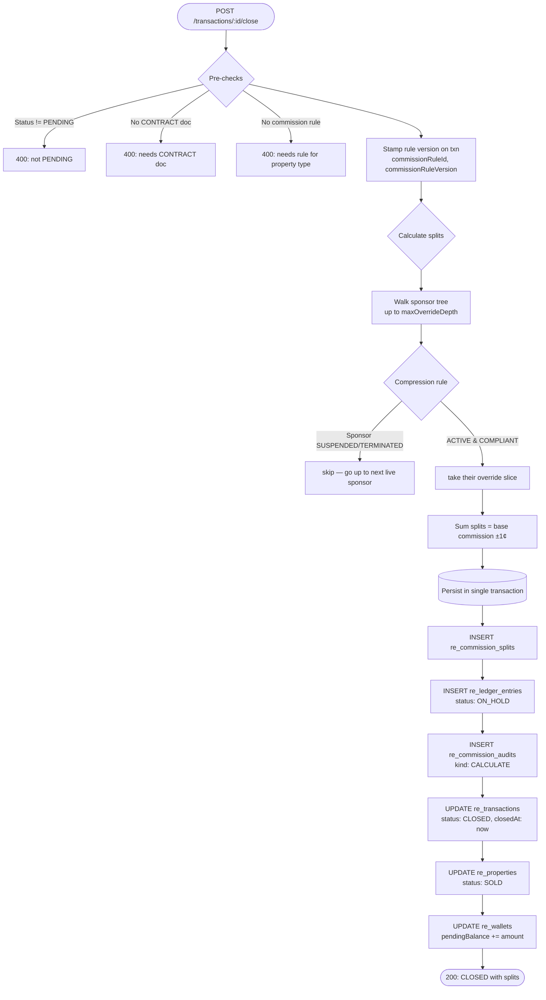

### 7.2 Commission split breakdown for a typical sale

For `TXN-SEED-001` (Andheri 3BHK, ₹49 L sale price, 2% commission rule, listing=Arjun, selling=Priya, you are the principal broker):

| Role            | Beneficiary | Percent | Amount  | Logic                                                       |
| --------------- | ----------- | ------- | ------- | ----------------------------------------------------------- |
| LISTING_AGENT   | Arjun       | 30%     | ₹14,700 | Direct listing share                                        |
| SELLING_AGENT   | Priya       | 30%     | ₹14,700 | Direct selling share                                        |
| OVERRIDE L1     | Priya       | 5%      | ₹2,450  | Arjun's sponsor — first override level                      |
| OVERRIDE L2     | You         | 3%      | ₹1,470  | Priya's sponsor — second override level                     |
| BROKERAGE       | House       | residual | ₹15,680 | Whatever's left after rounding so splits sum exactly to base |

The numbers above use `baseCommission = ₹49 L × 2% = ₹98,000` and rule v2 percents. The brokerage row absorbs all rounding deltas so the audit log always reconciles to the cent.

### 7.3 Compression rule (FR-5.6 / BR-8)

When walking the sponsor chain for overrides, the engine **skips** any upline agent whose `status` is not `ACTIVE` or whose `complianceStatus` is `NON_COMPLIANT`. The next eligible upline takes that slot. This means a suspended agent doesn't bottleneck their downline's commissions — and a non-compliant agent can't earn overrides until they fix their compliance.

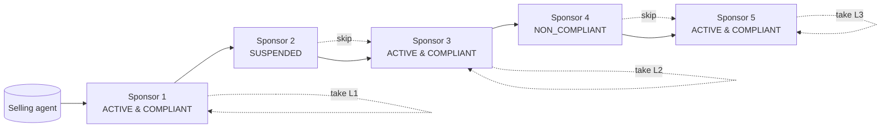

### 7.4 Hold period & release

Splits are written `ON_HOLD` at close time. After `holdPeriodDays` (default 30 in the seed's rule v2) the daily `releaseDueCommissions()` job promotes them to `RELEASED` — that's when wallet `availableBalance` increases and the agent can withdraw.

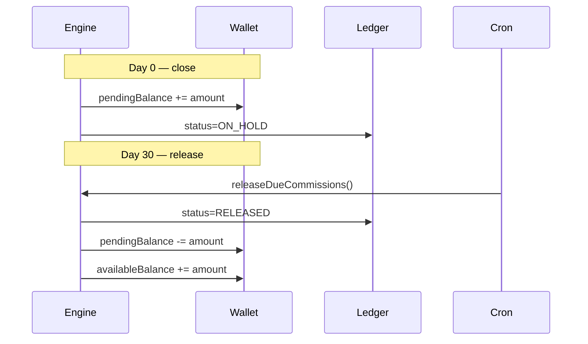

### 7.5 Rule versioning (FR-5.11 / BR-9)

The commission rule on a closed transaction is immutable. Editing a rule:

1. Marks the existing row `is_active=false`.
2. Creates a **new row** with `version = old.version + 1` and `is_active=true`.

Closed transactions retain their original `commissionRuleVersion`, so a recompute or audit is reproducible from history. New transactions opened after the edit get the new rule version.

### 7.6 Reverse path

If a closed transaction needs to be undone (`POST /transactions/:id/cancel`):

- Every `RELEASED` ledger entry gets a paired `REVERSED` entry of the opposite sign (debit if it was a credit).
- Every `ON_HOLD` entry is flipped to `REVERSED` directly.
- Wallet aggregates are recomputed from the ledger so they always reconcile.

This is why the ledger is **append-only** — you never delete entries, only add reversal entries.

**Where it lives**

- Engine: [`lib/real-estate/commission-engine.ts`](../lib/real-estate/commission-engine.ts)
- Wallet helpers: [`lib/real-estate/wallet-service.ts`](../lib/real-estate/wallet-service.ts)
- Handler: [`lib/api-handlers/real-estate-transactions.ts`](../lib/api-handlers/real-estate-transactions.ts)
- Pages: `/real-estate/transactions`, `/real-estate/transactions/[id]`, `/real-estate/admin/commission-rules`

---

## 8. Workflow 5 — Wallets, Ledger & Payouts

### 8.1 The append-only ledger

Every money movement writes a row in `re_ledger_entries`:

```
type:        CREDIT | DEBIT
category:    COMMISSION | OVERRIDE | BONUS | DESK_FEE | MARKETING_FEE |
             WITHDRAWAL | REFUND | ADJUSTMENT | REVERSAL | RANK_UP_BONUS
status:      ON_HOLD | RELEASED | REVERSED
amount:      Decimal(14,2)
balance_after: Decimal(14,2)   -- snapshot for fast forensic queries
reverses_entry_id: -> ledger_entries.id (for REVERSAL category)
```

Wallet aggregates (`availableBalance`, `pendingBalance`, `totalCredits`, `totalDebits`) are derived from the ledger. The `wallet-service.reconcile()` helper recomputes them from `SUM(amount)` queries so any drift can be detected and fixed.

### 8.2 Bank account encryption

`re_bank_accounts.account_number` is encrypted at rest with **AES-256-GCM** keyed by `REBM_BANK_KEY` (env var, falls back to a dev key). `account_number_last4` is stored plaintext for UI rendering. The reveal endpoint requires re-authentication via password and records an audit event before returning the decrypted full number.

```
plaintext: 1234567890123456
                 │
                 ├─ AES-256-GCM(key=REBM_BANK_KEY) ──> ciphertext + iv + tag
                 └─ last 4 chars ────────────────────> "3456" (plaintext)

storage row: { ciphertext, iv, tag, accountNumberLast4: "3456" }
```

### 8.3 Withdrawal state machine

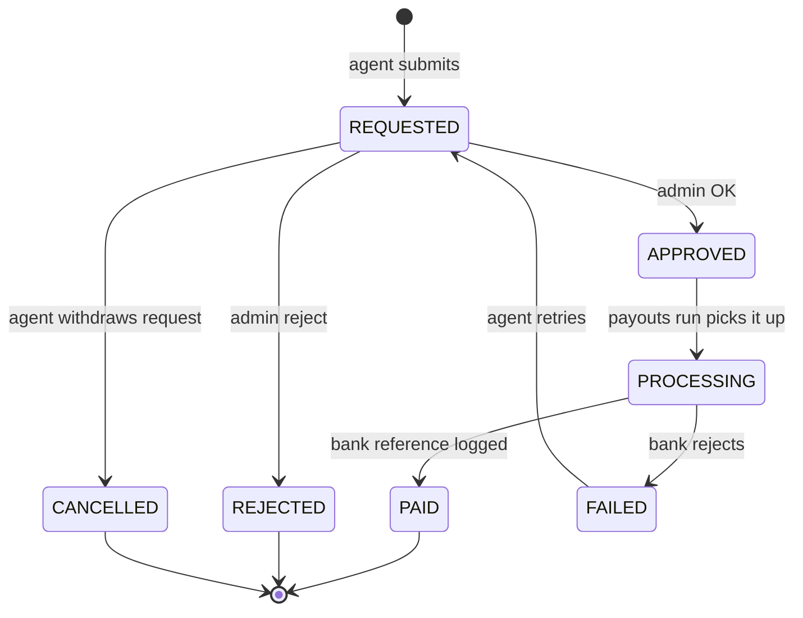

A withdrawal **debits** the wallet at REQUESTED time (so the same balance can't be withdrawn twice). If the request is rejected/cancelled/failed, a REVERSAL entry credits the wallet back.

**Where it lives**

- Service: [`lib/real-estate/wallet-service.ts`](../lib/real-estate/wallet-service.ts), [`lib/real-estate/bank-crypto.ts`](../lib/real-estate/bank-crypto.ts)
- Handler: [`lib/api-handlers/real-estate-finance.ts`](../lib/api-handlers/real-estate-finance.ts)
- Pages: `/real-estate/wallet`, `/real-estate/payouts`

---

## 9. Workflow 6 — Compliance Verification

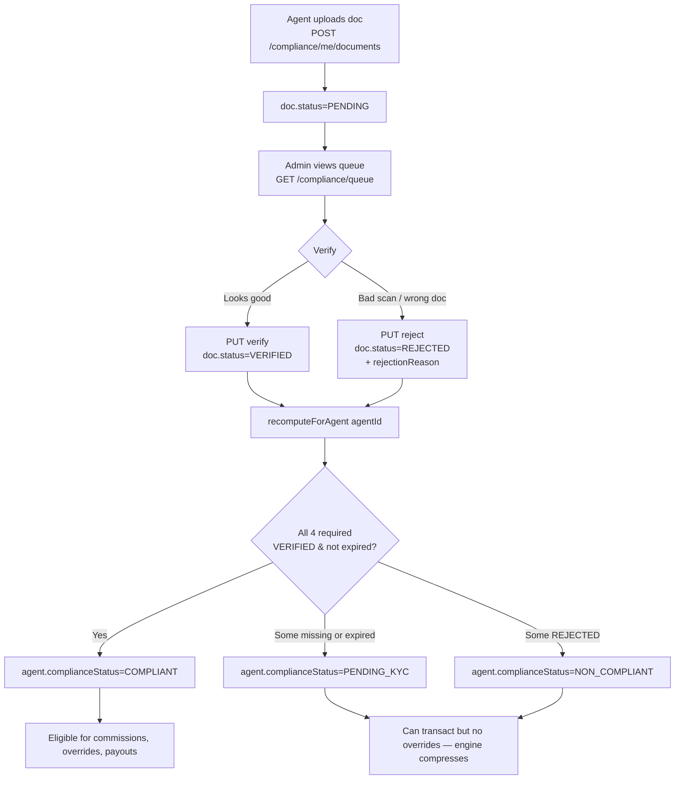

### 9.1 Expiry tracking

`recomputeAllStale()` is a daily job that scans for documents whose `expiry_date` is in the past and flips their status to `EXPIRED`. It then triggers `recomputeForAgent()` so the agent's overall status updates the same day.

`listExpiringSoon(daysAhead = 30)` powers the agent-list amber alert — "**N agents have a license expiring in the next 30 days.**"

**Where it lives**

- Service: [`lib/real-estate/compliance-service.ts`](../lib/real-estate/compliance-service.ts)
- Handler: [`lib/api-handlers/real-estate-compliance.ts`](../lib/api-handlers/real-estate-compliance.ts)
- Pages: `/real-estate/compliance` (my docs), `/real-estate/admin/compliance` (verification queue)

---

## 10. Workflow 7 — Rank Promotion Engine

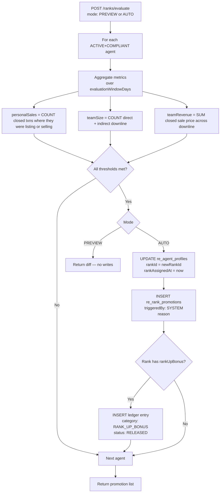

The engine is **idempotent** — running it twice in a row does nothing on the second run because the metrics didn't change. It's safe to run on a cron with a generous overlap window.

`PREVIEW` mode returns the same shape as `AUTO` but writes nothing. The admin UI uses this to show "if I run promotions now, here's who would be promoted" before the user clicks the AUTO button.

**Where it lives**

- Service: [`lib/real-estate/rank-promotion-service.ts`](../lib/real-estate/rank-promotion-service.ts)
- Pages: `/real-estate/admin/ranks` (preview + run), `/real-estate/agents/ranks` (config)

---

## 11. Reports & Analytics

Eight reports, each backed by a single SQL aggregation:

| Report                | What it answers                                            | Service fn                  |
| --------------------- | ---------------------------------------------------------- | --------------------------- |
| Sales register        | All closed transactions in a date range                    | `salesRegister()`           |
| Commission register   | Commission splits — per role, per agent, with status       | `commissionRegister()`      |
| Payout register       | Withdrawals — requested, approved, paid                    | `payoutRegister()`          |
| Lead conversion       | Conversion rate, bucket by source/score/status             | `leadConversionReport()`    |
| Top agents leaderboard| Sales count, revenue, commission earned                    | `topAgentsLeaderboard()`    |
| Property aging        | Days on market, status filter                              | `propertyAgingReport()`     |
| Compliance status     | Per-agent doc tally + summary                              | `complianceStatusReport()`  |
| Tax statement         | Per-agent FY (Apr 1 → Mar 31) gross/reversed/net commissions | `taxStatement()`            |

```mermaid
flowchart LR
  Page[/real-estate/reports/*/] --> RTK[useGetXReportQuery]
  RTK --> Route[/api/real-estate/reports/X]
  Route --> Service[reports-service.ts]
  Service --> SQL[(Single SQL aggregation)]
  SQL --> JSON[Typed JSON response]
  JSON --> Page
```

**Where it lives**

- Service: [`lib/real-estate/reports-service.ts`](../lib/real-estate/reports-service.ts)
- Pages: `/real-estate/reports/*` — one page per report

---

## 12. UI Architecture

The REBM module ships its own modern workspace shell on top of shadcn primitives. Every list page uses the same building blocks so users learn the muscle memory once and reuse it everywhere.

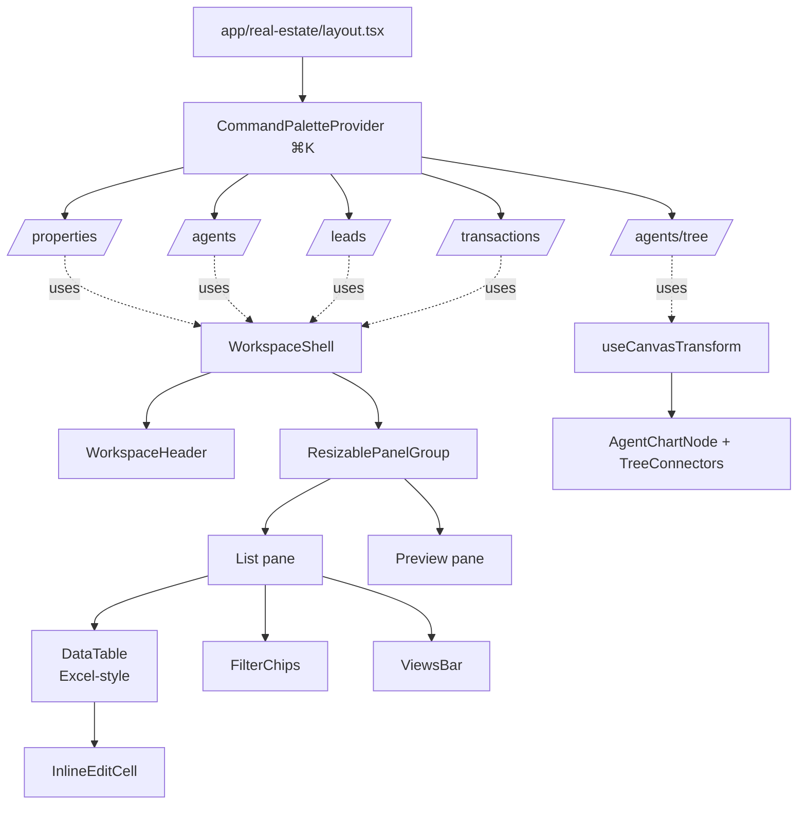

### 12.1 Workspace shell

[`components/real-estate/workspace/workspace-shell.tsx`](../components/real-estate/workspace/workspace-shell.tsx)

- **Resizable list/preview** on desktop via `react-resizable-panels`. Drag the divider — sizes persist per scope (`localStorage` key `rebm:layout:<scope>`).
- **Mobile fallback** auto-detected via media query: list takes full width; selecting an item slides a `Sheet` in from the right.
- **Maximize/restore** preview pane; **close** clears `selectedId`.
- Sticky header on top with title, subtitle (count + sync state), search, and CTA buttons.

### 12.2 Excel-style data table

[`components/real-estate/workspace/data-table.tsx`](../components/real-estate/workspace/data-table.tsx)

| Excel feature        | How it works                                                                |
| -------------------- | --------------------------------------------------------------------------- |
| Row number gutter    | Sticky leftmost column showing 1, 2, 3… highlighted when in selection       |
| Frozen columns       | Pinned columns sticky-left after the gutter, with a divider shadow          |
| Full grid lines      | `border-r` / `border-b` on every cell                                       |
| Active cell          | Click any cell → blue ring (`ring-2 ring-primary ring-inset`)               |
| Range selection      | Shift+click extends; mouse-drag to marquee-select                           |
| Keyboard navigation  | Arrow keys move; Home/End jump in row; Ctrl+Home/End jump to corners; Tab/Shift+Tab horizontal; Enter advances and triggers row-click |
| Copy → clipboard     | Ctrl/⌘+C copies the rectangle as TSV — paste straight into Excel/Sheets    |
| Status bar           | A1-style ref, cell/row/col counts, and Sum/Avg for any numeric (right-aligned) cells in the range |
| Sortable headers     | Click cycles asc → desc → none                                              |
| Resizable columns    | Drag the right edge of any header — widths persist per user                 |
| Density toggle       | Comfy / Compact in the gear menu                                            |
| Column visibility    | Checkbox list in the gear menu                                              |

#### Cell selection model

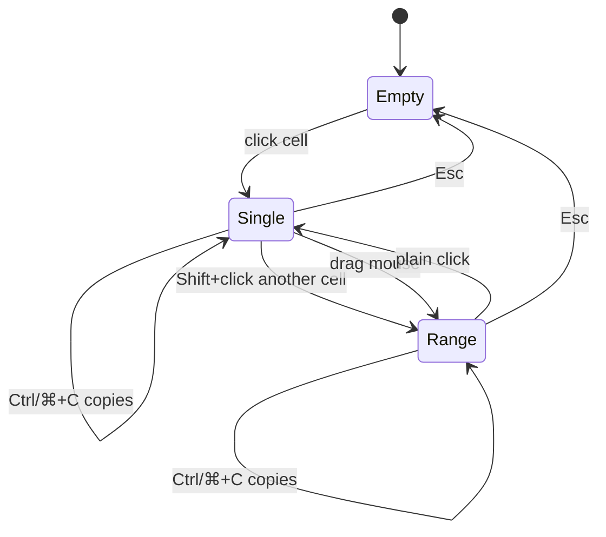

`copyValue: (row) => string` lives on each `ColumnDef` — it's the plain-text equivalent of `cell()` and powers both the clipboard write and the Sum/Avg detection in the status bar.

### 12.3 Command palette (⌘K)

[`components/real-estate/workspace/command-palette.tsx`](../components/real-estate/workspace/command-palette.tsx)

Mounted globally by [`app/real-estate/layout.tsx`](../app/real-estate/layout.tsx). Press ⌘K (or Ctrl+K) anywhere in `/real-estate/*` to:

- Search **properties / agents / leads / transactions** in parallel via RTK Query (skipped until the user types ≥2 chars)
- Jump to any module page
- Trigger quick actions ("New listing", "Capture lead", "Onboard agent")

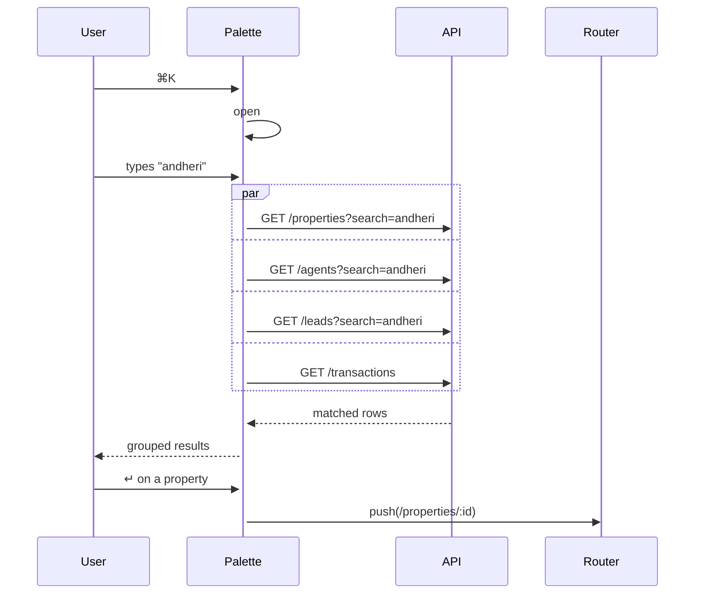

### 12.4 Agent tree canvas

[`app/real-estate/agents/tree/page.tsx`](../app/real-estate/agents/tree/page.tsx)

Visually paired with `/settings/company` — same `useCanvasTransform` hook, same `TreeConnectors`, same neo-brutalist node shadow. Differences:

- Nodes are [`AgentChartNode`](../components/real-estate/workspace/agent-chart-node.tsx) — avatar + name + email + rank/status/compliance badges + recruits/team counts.
- Status drives the card border accent: ACTIVE = slate, SUSPENDED = amber, TERMINATED = red, PENDING_KYC = slate.
- Search highlights the matching node and auto-expands its ancestors.
- Status pills in the header show live counts: Active / Pending / Suspended / Terminated.
- Toolbar: full-screen, zoom +/-, percentage indicator, center button, expand-all / collapse-all, drag-to-pan, wheel-to-zoom.

### 12.5 Persistence keys (localStorage)

| Key pattern                  | What                                              |
| ---------------------------- | ------------------------------------------------- |
| `rebm:layout:<scope>`        | List/preview pane sizes per scope                 |
| `rebm:table:<tableId>`       | Column hidden/width/sort/density per table        |
| `rebm:views:<scope>`         | Saved filter views                                |
| `rebm:leads:view`            | Leads page mode (`list` vs `kanban`)              |

Each scope is independent — your wide-list view in Properties doesn't affect Leads.

---

## 13. Setup, Seeding & Sidebar Install

### 13.1 First-time setup

```bash
# 1. Push schema
npx prisma db push

# 2. Run the seed (Windows PowerShell — no psql needed)
npx prisma db execute --file ./prisma/seed-real-estate.sql --schema ./prisma/schema.prisma

# 3. Open app, sign in, visit:
http://localhost:3000/real-estate
```

### 13.2 What the seed creates

[`prisma/seed-real-estate.sql`](../prisma/seed-real-estate.sql) is targeted at one specific org/user and creates:

| Section            | Count | Notes                                                    |
| ------------------ | ----- | -------------------------------------------------------- |
| Dummy users        | 9     | All `*.brokerage.test` emails — easy to identify and delete |
| Sidebar wiring     | 1     | `re_form_modules` row + `static_page_anchors` row         |
| Ranks              | 4     | Trainee / Associate / Senior Partner / MD                |
| Commission rules   | 2     | v1 inactive (history) + v2 active                        |
| Agent profiles     | 10    | 3-level MLM tree, every status & compliance state        |
| Properties         | 12    | Mixed types/cities/statuses                              |
| Property images    | 36    | 3 per property                                           |
| Property documents | 12    | 1 per property                                           |
| Buyers             | 3     | For TXN-SEED-001/002/003                                 |
| Leads              | 12    | One per pipeline stage                                   |
| Lead activities    | 19    |                                                          |
| Viewings           | 5     | Mixed scheduled / completed / no-show                    |
| Compliance docs    | 13    | Mix of statuses for verification queue testing           |
| Wallets            | 9     | Suspended/terminated agents have `is_frozen=true`        |
| Ledger entries     | 7     | Onboarding / rank-up / first-listing bonuses              |
| Transactions       | 3     | All `PENDING` with CONTRACT docs — ready to close        |

### 13.3 Sidebar install (one-click)

REBM pages live at `/real-estate/*` but only show in the sidebar after the page is **anchored** to a `FormModule`. This is the [`/api/real-estate/install`](../app/api/real-estate/install/route.ts) endpoint:

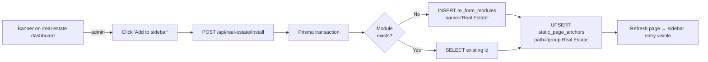

The seed already wires this in, so the banner self-hides if you ran the seed.

### 13.4 Demo: closing TXN-SEED-001 end-to-end

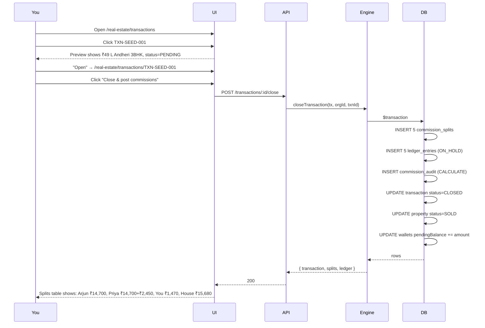

---

## 14. Demo Walkthrough

After running the seed, here's a 10-minute tour:

1. **`/real-estate`** — Dashboard. Press ⌘K, type "andheri" — the property surfaces. Type "priya" — Priya Sharma surfaces.
2. **`/real-estate/properties`** — Click any row. Drag the divider between list and preview. Click the gear in the header → toggle column visibility, switch density. Click any cell, then Shift+click another to make a range — bottom status bar shows A1 ref + Sum/Avg. Hit Ctrl+C, paste into Excel.
3. **`/real-estate/agents/tree`** — Pan/zoom canvas. Search "rahul" — his card pulses (he's the one with `NON_COMPLIANT` license). Hover any node for actions. Notice Aisha (SUSPENDED) has an amber border, Karan (TERMINATED) has red.
4. **`/real-estate/agents`** — Inline-edit Arjun's status from `ACTIVE` to `SUSPENDED` directly in the table. Watch the badge update without a page refresh.
5. **`/real-estate/leads`** — Toggle to Kanban view (top-right). Drag a lead's status inline back in list view.
6. **`/real-estate/transactions/TXN-SEED-001`** — Click "Close & post commissions". Watch the splits table populate with the 5 rows from the engine.
7. **`/real-estate/wallet`** (as the principal broker) — your `pendingBalance` should now show ₹1,470 (your override from the close).
8. **`/real-estate/admin/compliance`** — verify Sneha's pending Aadhaar. Her agent compliance recomputes automatically.
9. **`/real-estate/admin/ranks`** — click "Preview promotions". Neha (already promoted in the seed) won't appear; if you advance time, others will.
10. **`/real-estate/reports`** — Sales register, commission register, leaderboard. After closing the txn, all three should reflect it.

---

## 15. File Inventory

### Schema & seed

- [`prisma/schema.prisma`](../prisma/schema.prisma) — all `re_*` tables
- [`prisma/seed-real-estate.sql`](../prisma/seed-real-estate.sql) — 844-line idempotent seed

### Services (pure logic, no HTTP)

- [`lib/real-estate/commission-engine.ts`](../lib/real-estate/commission-engine.ts) — close, reverse, release, preview
- [`lib/real-estate/wallet-service.ts`](../lib/real-estate/wallet-service.ts) — append-only ledger writes, reconcile
- [`lib/real-estate/bank-crypto.ts`](../lib/real-estate/bank-crypto.ts) — AES-256-GCM
- [`lib/real-estate/compliance-service.ts`](../lib/real-estate/compliance-service.ts) — recomputeForAgent, recomputeAllStale, listExpiringSoon
- [`lib/real-estate/rank-promotion-service.ts`](../lib/real-estate/rank-promotion-service.ts) — evaluatePromotions(PREVIEW/AUTO)
- [`lib/real-estate/reports-service.ts`](../lib/real-estate/reports-service.ts) — 8 report aggregations

### API handlers (auth + validation + service calls)

- [`lib/api-handlers/real-estate-properties.ts`](../lib/api-handlers/real-estate-properties.ts)
- [`lib/api-handlers/real-estate-agents.ts`](../lib/api-handlers/real-estate-agents.ts)
- [`lib/api-handlers/real-estate-leads.ts`](../lib/api-handlers/real-estate-leads.ts)
- [`lib/api-handlers/real-estate-transactions.ts`](../lib/api-handlers/real-estate-transactions.ts)
- [`lib/api-handlers/real-estate-finance.ts`](../lib/api-handlers/real-estate-finance.ts)
- [`lib/api-handlers/real-estate-compliance.ts`](../lib/api-handlers/real-estate-compliance.ts) — also has ReportHandlers, RankPromotionHandlers
- [`lib/api-handlers/real-estate-install.ts`](../lib/api-handlers/real-estate-install.ts) — sidebar wiring

### API routes (`app/api/real-estate/**/route.ts`)

```
properties/                   leads/                  transactions/
  [id]/                         [id]/                    [id]/
    images/                       activities/              documents/
    documents/                    convert/                 close/
    price-history/              viewings/                  cancel/
agents/                       wallet/                      preview/
  [id]/                         me/                    commission-rules/
  tree/                         ledger/                  [id]/
  ranks/                      bank-accounts/           compliance/
  ranks/[id]/                   me/                      me/
  ranks/evaluate/               [id]/reveal/             queue/
                              withdrawals/                expiring/
                                me/                      agents/[id]/
                                [id]/                  reports/
                                  approve/                 sales/
                                  reject/                  commission/
                                  cancel/                  payouts/
                                  pay/                     conversion/
                              install/                     leaderboard/
                                                           aging/
                                                           compliance/
                                                           tax/
```

### Client API (RTK Query)

- [`lib/api/baseApi.ts`](../lib/api/baseApi.ts) — tag types
- [`lib/api/real-estate/types.ts`](../lib/api/real-estate/types.ts) — all client types
- [`lib/api/real-estate/properties.ts`](../lib/api/real-estate/properties.ts)
- [`lib/api/real-estate/agents.ts`](../lib/api/real-estate/agents.ts)
- [`lib/api/real-estate/leads.ts`](../lib/api/real-estate/leads.ts)
- [`lib/api/real-estate/transactions.ts`](../lib/api/real-estate/transactions.ts)
- [`lib/api/real-estate/finance.ts`](../lib/api/real-estate/finance.ts)
- [`lib/api/real-estate/compliance.ts`](../lib/api/real-estate/compliance.ts)
- [`lib/api/real-estate/reports.ts`](../lib/api/real-estate/reports.ts)

### UI

- [`app/real-estate/layout.tsx`](../app/real-estate/layout.tsx) — mounts CommandPaletteProvider
- [`app/real-estate/page.tsx`](../app/real-estate/page.tsx) — dashboard
- [`app/real-estate/properties/`](../app/real-estate/properties/), [`agents/`](../app/real-estate/agents/), [`leads/`](../app/real-estate/leads/), [`transactions/`](../app/real-estate/transactions/) — list + detail + new + edit
- [`app/real-estate/agents/tree/`](../app/real-estate/agents/tree/) — canvas tree
- [`app/real-estate/wallet/`](../app/real-estate/wallet/), [`payouts/`](../app/real-estate/payouts/), [`compliance/`](../app/real-estate/compliance/), [`reports/`](../app/real-estate/reports/), [`admin/`](../app/real-estate/admin/) — Phase 2/3 surfaces
- [`components/real-estate/workspace/`](../components/real-estate/workspace/) — Excel table, shell, palette, agent-chart-node, hooks
- [`components/real-estate/constants.ts`](../components/real-estate/constants.ts) — labels, badge variants, formatters
- [`components/real-estate/property-form.tsx`](../components/real-estate/property-form.tsx) — shared property form

### Static page registry

- [`lib/static-pages.ts`](../lib/static-pages.ts) — REBM page paths registered under the "Real Estate" group

---

## 16. Glossary

| Term                   | Meaning                                                                                       |
| ---------------------- | --------------------------------------------------------------------------------------------- |
| **MLM**                | Multi-level marketing — commission structure where uplines earn override % of downline sales  |
| **Override**           | Commission earned on a downline's sale, not your own — capped by `maxOverrideDepth`           |
| **Compression**        | Skipping suspended/non-compliant uplines so their downline doesn't lose override depth (BR-8) |
| **Sponsor edge**       | Who recruited the agent — drives the override walk                                            |
| **Parent edge**        | Who manages the agent organisationally — drives reporting hierarchy                           |
| **Hold period**        | Days a commission split sits `ON_HOLD` before being `RELEASED` to the agent's wallet           |
| **Compliance status**  | Derived from required docs — `COMPLIANT` requires all 4 doc types `VERIFIED` and unexpired   |
| **Rule version**       | Closed transactions retain the rule version stamped at close-time so audits are reproducible  |
| **Append-only ledger** | Ledger entries are never deleted; reversals add new opposite-sign entries linked via `reverses_entry_id` |
| **Sidebar anchor**     | A `static_page_anchors` row that ties a static page (e.g. `/real-estate/properties`) to a parent `FormModule`, making it visible in the sidebar |
| **Static page**        | A page that exists at a hard-coded URL but isn't in the `Forms` builder — REBM pages are all static |
| **Workspace shell**    | The shared list/preview layout used by all four REBM list pages                               |
| **Saved view**         | A named bundle of filter settings persisted in localStorage per page                          |
| **Excel-style table**  | The DataTable component with row gutter, frozen columns, cell selection, keyboard nav, TSV copy |

---

> **Have a question this doc doesn't answer?** Read the source — the services in `lib/real-estate/` are the source of truth for every workflow described here, and they are heavily commented. Start at [`commission-engine.ts`](../lib/real-estate/commission-engine.ts) — it's the most important file in the module.
