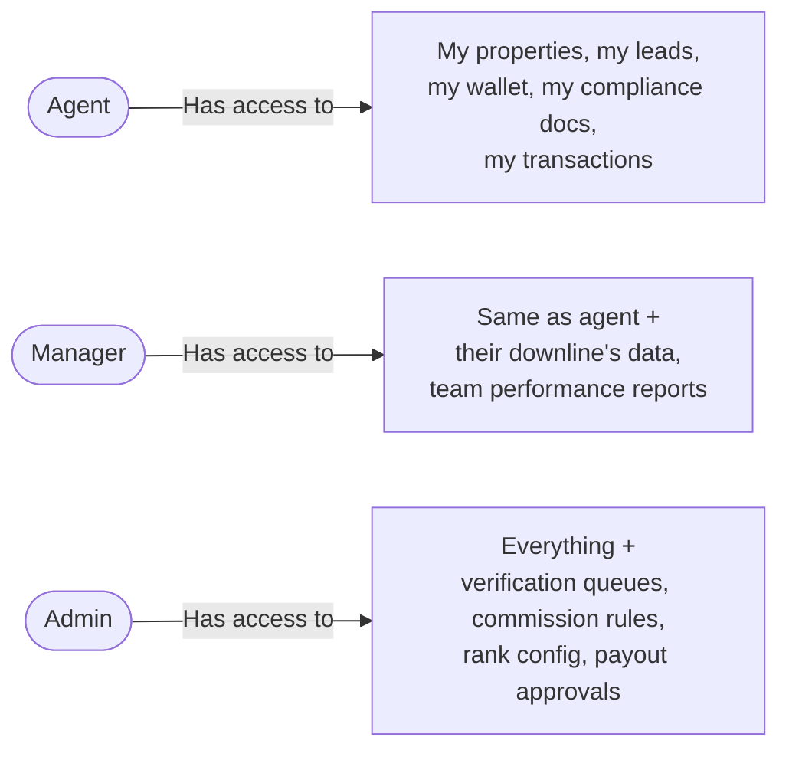
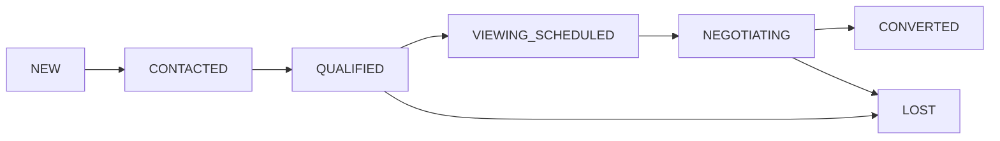
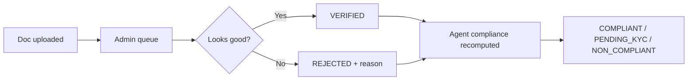
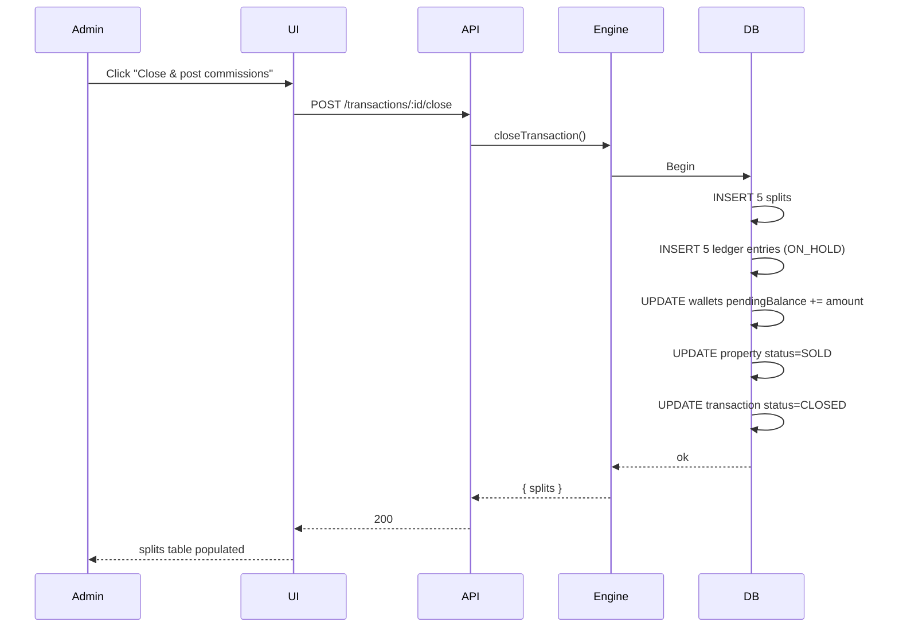
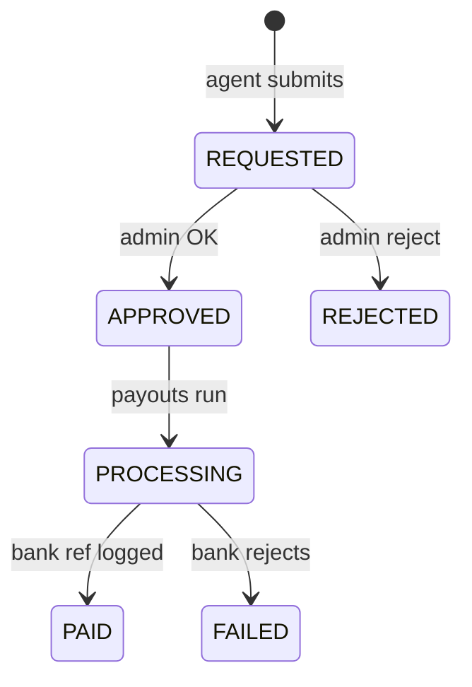
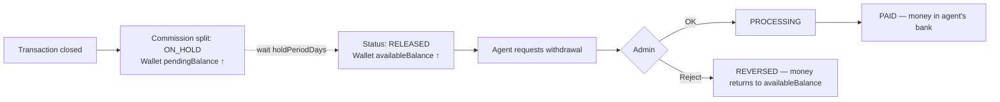

# Real Estate Brokerage — How to Use It

> **Audience:** Brokerage staff using the system day-to-day — admins, managers, agents.
> **Companion to:** [`REAL_ESTATE_MODULE_GUIDE.md`](./REAL_ESTATE_MODULE_GUIDE.md) (the engineering deep-dive — read that if you want to know *why*; read this if you just want to know *how*).

---

## Table of Contents

1.  [Quick Start](#1-quick-start)
2.  [The Mental Model](#2-the-mental-model)
3.  [Universal Shortcuts](#3-universal-shortcuts)
4.  [Roles & What They See](#4-roles--what-they-see)
5.  [Daily Tasks for Agents](#5-daily-tasks-for-agents)
6.  [Daily Tasks for Managers](#6-daily-tasks-for-managers)
7.  [Daily Tasks for Admins](#7-daily-tasks-for-admins)
8.  [Working in the Excel Table](#8-working-in-the-excel-table)
9.  [The Agent Tree](#9-the-agent-tree)
10. [Reports — Which One When](#10-reports--which-one-when)
11. [Money Flow — Wallet & Payouts](#11-money-flow--wallet--payouts)
12. [Troubleshooting / FAQ](#12-troubleshooting--faq)
13. [Cheat Sheet](#13-cheat-sheet)

---

## 1. Quick Start

1. **Sign in** to the ERP.
2. Look for **Real Estate** in the left sidebar. (If it's not there, an admin needs to run the seed or visit `/real-estate` to install it.)
3. Click it. You land on the dashboard at `/real-estate`.
4. **Press ⌘K (Mac) or Ctrl+K (Windows)** anywhere in the module — that's your jump-anywhere shortcut. Type a property name, agent name, lead name, or transaction code — hit Enter to navigate.

That's it. Everything else is one click from the dashboard.

---

## 2. The Mental Model

Think of the brokerage as five connected things:

```
   PROPERTIES              ←→         AGENTS
   (what you sell)                  (who sells)
        ↓                                ↓
        └────────────→  LEADS  ←─────────┘
                    (who's buying)
                          ↓
                      VIEWINGS
                          ↓
                     TRANSACTIONS
                  (the actual sale)
                          ↓
        ┌─────────────────┴─────────────────┐
        ↓                                   ↓
   COMMISSIONS                          PROPERTIES
   (split among agents)              (status: SOLD)
        ↓
    WALLETS → PAYOUTS
```

**Five core pages, in the order work flows through them:**

| Page                    | Path                          | What lives here                        |
| ----------------------- | ----------------------------- | -------------------------------------- |
| Properties              | `/real-estate/properties`     | Your inventory — listings              |
| Agents                  | `/real-estate/agents`         | Your team — name, rank, status         |
| Leads                   | `/real-estate/leads`          | Buyer interest — pipeline kanban       |
| Transactions            | `/real-estate/transactions`   | Closed (or in-flight) sales            |
| Wallet                  | `/real-estate/wallet`         | Your earnings, pending and available   |

**Three admin-only pages:**

| Page                  | Path                                | What it does                           |
| --------------------- | ----------------------------------- | -------------------------------------- |
| Compliance queue      | `/real-estate/admin/compliance`     | Verify agent KYC documents             |
| Commission rules      | `/real-estate/admin/commission-rules` | Set the % splits the engine uses     |
| Ranks                 | `/real-estate/admin/ranks`          | Configure ranks + run promotions       |

---

## 3. Universal Shortcuts

These work on **every** Real Estate page.

| Shortcut          | What it does                                                        |
| ----------------- | ------------------------------------------------------------------- |
| **⌘K** / **Ctrl+K** | Open the quick-search palette — find any property, agent, lead, or transaction by name. Use it instead of clicking through pages. |
| Click a row       | Open the preview pane on the right                                  |
| Drag the divider  | Resize the list / preview panes — your choice persists per user     |
| **Esc**           | Close the preview pane (or cancel an inline edit)                   |
| Click any cell    | Make it the active cell (Excel-style)                               |
| **Ctrl/⌘+C**      | Copy the selected cells (paste into Excel / Sheets)                 |
| **Arrow keys**    | Move the active cell                                                |

**The palette is the fastest way to navigate.** Once you've used the system for a day you'll stop clicking the sidebar and just press ⌘K for everything.

---

## 4. Roles & What They See



If you don't see a button or page mentioned in this guide, it's because your role doesn't have access. Ask an admin.

---

## 5. Daily Tasks for Agents

### 5.1 Capture a new lead

When someone calls or walks in interested in buying:

1. Press **⌘K** → type "capture lead" → Enter.
   *(Or click the dashboard's "Quick actions" → "Capture lead".)*
2. Fill in **name, phone, email**, budget range, preferred cities, property types.
3. Set **score**: HOT (ready to buy), WARM (interested but timeline unclear), COLD (just browsing).
4. Save. Lead appears in `/real-estate/leads` with status **NEW**.

### 5.2 Move a lead through the pipeline



Two ways to advance the status:

**Quick way — inline edit (list view):**
1. Open `/real-estate/leads`.
2. Click the **Stage** cell on the lead's row.
3. Pick the new stage from the dropdown. Saves immediately.

**Visual way — Kanban (also fast):**
1. Open `/real-estate/leads`.
2. Click the grid icon (top-right of toolbar) to switch to Kanban view.
3. Drag the lead's card to the next column.
*(Note: drag-and-drop in kanban is a roadmap feature; for now click into the lead → Edit → change stage.)*

### 5.3 Schedule a viewing

1. Open the lead. Click **"Schedule viewing"** (or use ⌘K → "viewings" → New).
2. Pick the **property**, the **date/time**, and the **agent** showing it (defaults to you).
3. Save. The lead's status auto-advances to **VIEWING_SCHEDULED**.

### 5.4 Log call / email / meeting on a lead

1. Open the lead's detail page.
2. Activity timeline is on the right. Click **"Log activity"**.
3. Pick type (CALL / EMAIL / MEETING / NOTE), add a subject + content.
4. Save.

This auto-updates `lastContactedAt` so the follow-up reminder goes quiet. Nice touch: agents who are good at logging activity look great in the **leaderboard report**.

### 5.5 Convert a lead to a buyer

When the deal is on:
1. Open the lead. Click **"Convert to buyer"**.
2. Fill in the buyer's address, ID type, KYC info.
3. Save. The lead becomes status **CONVERTED**, and a **Buyer** record is created — the buyer is now eligible to be tied to a transaction.

### 5.6 List a new property

1. ⌘K → "new listing" → Enter (or `/real-estate/properties/new`).
2. Fill in:
   - **Title** (e.g. "3 BHK Sky View, Andheri West")
   - **Code** (your internal ref — optional)
   - **Type** (Residential / Commercial / Land / Industrial / Agricultural)
   - **Sub-type** (Apartment / Villa / Office etc.)
   - **Listing price** + currency
   - **Address, city, state**
   - **Beds / baths / area** for residential
   - **Commission terms** (percentage of sale price, or flat fee)
3. Save → **DRAFT** status. Add images and documents in the next two tabs.
4. When ready, change status to **AVAILABLE**.

### 5.7 Upload property photos

1. Open the property → **Images** tab.
2. Click **Add image** → paste a URL (or upload — admin must wire object storage).
3. Star one as **primary** — that's the image that shows in lists, search results, and dashboards.

### 5.8 Update a price (creates audit trail)

1. Open the property → **Edit**.
2. Change `Listing price`. **You must enter a reason** for the change (the schema enforces this).
3. Save. A row is added to `re_property_price_history` so you can always see who changed the price, when, and why.

### 5.9 Upload your KYC documents

1. ⌘K → "compliance" → Enter (or `/real-estate/compliance`).
2. The page lists the **4 required document types**:
   - Government ID (Aadhaar / passport)
   - Real Estate License (MahaRERA etc.)
   - Tax Form (PAN)
   - Agency Agreement
3. For each, click **Upload**, paste the URL or upload a scan, fill in the issuing authority + expiry where applicable.
4. Status starts as **PENDING**. An admin verifies it. Once all 4 are **VERIFIED**, your compliance status flips to **COMPLIANT** and you become eligible for override commissions.

### 5.10 Add a bank account

Required before you can withdraw earnings.

1. ⌘K → "bank accounts" → Enter (or `/real-estate/wallet` → **Bank accounts** tab).
2. Click **Add account** — bank name, account holder, full account number (encrypted at rest), IFSC, branch.
3. Mark one as **Primary**. Save.
4. The full number is hidden after save — only the last 4 show. Click **Reveal** + re-enter your password if you need to view it again.

### 5.11 Request a withdrawal

1. Open `/real-estate/wallet`.
2. Check **Available balance** — that's what you can withdraw (released, hold period over).
3. Click **Request withdrawal** → enter amount → pick bank account → submit.
4. State machine: **REQUESTED** → admin approves → **PROCESSING** → bank pays → **PAID**. You get a notification at each step.

---

## 6. Daily Tasks for Managers

You can do everything an agent can, plus:

### 6.1 See your team's performance

1. ⌘K → "leaderboard" → Enter (or `/real-estate/reports/leaderboard`).
2. Filter by **date range** and **rank**. See:
   - Sales count per agent
   - Revenue closed
   - Commission earned
3. Sort by any column. Use Ctrl+C to copy the table to Excel for a weekly review email.

### 6.2 Track your team's pipeline

1. `/real-estate/leads` → **Saved views** bar at the top.
2. Click **+** → name it "My team — hot leads" → save.
3. Filter for the leads you care about (e.g. score=HOT, assigned to people in your downline).
4. The view persists. One click to come back to it.

### 6.3 See your downline tree

1. `/real-estate/agents/tree` — interactive canvas.
2. Drag to pan. Scroll/pinch to zoom. Click **expand all / collapse all** in the toolbar.
3. Search the toolbar input — the matching agent's card glows; their ancestors auto-expand so you can see them.
4. Click any agent's card to open their full profile.
5. **Status accents at a glance:**
   - Slate border = ACTIVE / PENDING_KYC (normal)
   - Amber border + amber shadow = SUSPENDED
   - Red border + red shadow = TERMINATED

### 6.4 Onboard a recruit

1. ⌘K → "onboard agent" → Enter.
2. Pick the underlying user (must already have an ERP account).
3. Set their **sponsor** = you (this is what makes you their upline for commissions).
4. Optional: set **parent** different from sponsor if their reporting line differs from their MLM line.
5. Set initial rank (usually Trainee).
6. Save → status **PENDING_KYC** until they upload docs and you (or an admin) verify.

---

## 7. Daily Tasks for Admins

Everything from sections 5 and 6, plus the admin-only surfaces.

### 7.1 Verify compliance documents

This is the gatekeeper for who earns overrides.

1. ⌘K → "compliance queue" → Enter (or `/real-estate/admin/compliance`).
2. The queue lists every document with status **PENDING**. Newest first.
3. Click a row to preview. Three buttons:
   - **Verify** → status VERIFIED. The agent's overall compliance recomputes automatically.
   - **Reject** → status REJECTED. Type a reason (the agent sees it). They can re-upload.
   - **Skip** → leaves it pending; the next admin can pick it up.



### 7.2 Configure commission rules

The rule that decides how a sale's commission is split.

1. ⌘K → "commission rules" → Enter (or `/real-estate/admin/commission-rules`).
2. Existing rules list. Click **New rule**.
3. Configure:
   - **Property type** (specific or null = applies to all)
   - **Listing agent %**, **Selling agent %**, **Brokerage %**, **Override percents** (array — first entry is L1 override, second is L2, etc.)
   - **Hold period days** (how long commissions stay ON_HOLD before release)
   - **Compression rule** — leave on. (Skips suspended/non-compliant uplines.)
4. Save. Rule version 1 is created, marked **active**.

**Editing a rule does NOT modify the rule** — it creates a **new version** and deactivates the old one. Closed transactions retain their original rule version, so audits stay reproducible.

### 7.3 Close a transaction (fire the commission engine)

This is the magic moment.

1. Open `/real-estate/transactions`.
2. Find a **PENDING** transaction. Click it.
3. Pre-flight checklist (the page shows what's missing):
   - ✅ Has a CONTRACT document attached?
   - ✅ A commission rule exists for this property type?
   - ✅ Sale price + buyer + listing/selling agents set?
4. Click **"Close & post commissions"**.
5. The engine fires inside one DB transaction:
   - Splits computed (listing %, selling %, override walk through sponsor tree)
   - Ledger entries written ON_HOLD
   - Wallets' pending balance increased
   - Property status → SOLD
   - Transaction status → CLOSED
6. The splits table populates immediately — every share, every beneficiary, every percent.



### 7.4 Reverse a closed transaction

If a sale falls through:

1. Open the closed transaction.
2. Click **"Cancel transaction"** → enter a reason.
3. The engine fires in reverse:
   - Every split's status → REVERSED
   - Every ledger entry gets a paired REVERSAL entry (opposite sign)
   - Wallets recompute → balance goes back to pre-close state
   - Property status → AVAILABLE
4. Audit log keeps the original splits + the reversals so you can see exactly what was undone.

### 7.5 Approve / process / pay withdrawals



1. ⌘K → "payouts" → Enter (or `/real-estate/payouts`).
2. Filter by status REQUESTED. Click an entry.
3. Approve or reject. If reject, type a reason.
4. Once your bank disburses, mark **PAID** and paste the bank reference number for audit.

### 7.6 Run rank promotions

Once a month (or more often — it's idempotent and safe to run repeatedly):

1. ⌘K → "ranks" → Enter (or `/real-estate/admin/ranks`).
2. Click **"Preview promotions"** — shows everyone who **would** be promoted with the current data, **without writing anything**.
3. Review the list. Anyone you don't want promoted yet can be excluded by adjusting their stats or pausing their rank.
4. Click **"Run promotions"** — this time it writes:
   - `re_agent_profiles.rankId` updated
   - `re_rank_promotions` log entry inserted
   - Rank-up bonus credited to the agent's wallet (if the rank has one configured)
5. Toast confirms how many got promoted.

### 7.7 Onboard a new property type

Roughly:

1. Decide what splits apply.
2. `/real-estate/admin/commission-rules` → New rule → set `propertyType` to the new type → configure %.
3. List your first property of that type → status AVAILABLE → make sure the rule's percents look right by clicking **"Preview commission"** on a draft transaction.

---

## 8. Working in the Excel Table

The list pages (Properties / Agents / Leads / Transactions) use a custom data table that behaves like a spreadsheet. This is where you'll spend most of your time — invest 5 minutes learning these tricks.

### 8.1 Cell-level keyboard shortcuts

| Key                   | What                                       |
| --------------------- | ------------------------------------------ |
| Click cell            | Make it the active cell (blue ring)        |
| Arrow keys            | Move active cell                           |
| Shift + Arrow         | Extend the selection in that direction     |
| Shift + Click         | Extend selection to the clicked cell       |
| Drag mouse            | Marquee-select a rectangle                 |
| Home                  | Jump to first column of current row        |
| End                   | Jump to last column                        |
| Ctrl/⌘ + Home         | Jump to top-left corner                    |
| Ctrl/⌘ + End          | Jump to bottom-right                       |
| Tab                   | Next column                                |
| Shift + Tab           | Previous column                            |
| Enter                 | Next row + open preview pane               |
| Esc                   | Clear selection                            |
| **Ctrl/⌘ + C**        | **Copy selection as TSV → paste into Excel/Sheets** |

The bottom status bar shows your selection summary in Excel A1 notation: `B3:E12 · 40 cells · 10 rows · 4 cols`. If any selected cells are numeric (right-aligned columns like Price, Commission), you also get **Sum** and **Avg** — handy for "what's the total of these 12 deals" without leaving the page.

### 8.2 Columns: hide, resize, reorder by sort

1. **Hide a column** — click the gear icon (right side of the header row) → toggle the column off.
2. **Resize a column** — hover the right edge of any header → cursor turns to a resize handle → drag.
3. **Sort** — click any header with sort enabled. Click cycles **ascending → descending → none**.
4. **Density** — gear menu → **Comfy** or **Compact**. Compact is best for scanning hundreds of rows.

All of the above persists per user, per page.

### 8.3 Saved views

A view = a named bundle of filters.

1. Apply your filters (status chips, search, etc.).
2. Click the **+ bookmark** icon next to the view tabs.
3. Name it ("Andheri 3BHK pending", "Hot leads in BKC", whatever) → Save.
4. The view appears as a tab. Click to switch.
5. Active view tab shows a dot if you've changed filters but not saved — click **"• Unsaved"** to overwrite it with the new filters.

Common views to save up front:
- **My listings** (filter: listing agent = me)
- **Hot leads, Mumbai** (score = HOT, city = Mumbai)
- **Stuck negotiations** (status = NEGOTIATING, follow-up overdue)
- **Pending close** (status = PENDING + has CONTRACT doc)

### 8.4 Inline editing

Some columns are editable directly in the list — no need to open the row.

| Page          | Columns you can edit inline                    |
| ------------- | ---------------------------------------------- |
| Properties    | Status (DRAFT → AVAILABLE → etc.)              |
| Agents        | Status (PENDING_KYC / ACTIVE / SUSPENDED / TERMINATED) |
| Leads         | Stage (NEW → CONTACTED → … → CONVERTED)        |
| Transactions  | (none — closing requires the dedicated button)  |

How: click the cell → dropdown opens → pick → save happens immediately (optimistic update; if the server rejects, the change reverts and you see an error toast).

### 8.5 List ↔ Preview split

- Click any row → preview slides in from the right.
- Drag the divider to resize. Your width persists per page.
- Click the **maximize icon** (top of preview) to make it full-width — useful for reviewing details. Click again to restore split.
- Click **X** or press **Esc** to close.
- On mobile (or if the window is narrow), the preview opens as a sheet instead.

---

## 9. The Agent Tree

`/real-estate/agents/tree` is a **pan/zoom canvas** showing your whole MLM hierarchy.

```
                     ┌─────────────┐
                     │ You (MD)    │
                     └──────┬──────┘
              ┌─────────────┴─────────────┐
              │                           │
       ┌──────┴──────┐             ┌──────┴──────┐
       │ Senior      │             │ Senior      │
       │ Partner A   │             │ Partner B   │
       └──────┬──────┘             └──────┬──────┘
        ┌────┴────┐                  ┌────┴────┐
        │ Assoc.  │  Trainee         │ Assoc.  │
        └─────────┘                  └─────────┘
```

**Controls:**
- **Drag** anywhere → pan
- **Scroll wheel** / **pinch** → zoom in/out
- **Toolbar** zoom in/out + percentage indicator + center button
- **Full screen** button — fills the browser, useful on a TV/large monitor
- **Expand all / Collapse all** — handy if your tree is 100+ nodes
- **Search box** — type a name; the matching card pulses, ancestors auto-expand
- **Hover a card** → quick action buttons (Open profile, Edit) appear

**Status colors** (you should learn these):
- **Slate / black border + black shadow** = normal (ACTIVE or PENDING_KYC)
- **Amber border + amber shadow** = SUSPENDED — they exist in the tree but earn no overrides
- **Red border + red shadow** = TERMINATED — they're history; their downline gets compressed past them

**Counts on each card:**
- **Green pill** = direct recruits (their own children)
- **Indigo pill** = total downline (everyone under them, recursively)

**Collapsed nodes** show a number badge on the chevron — that's how many agents are hidden under it.

---

## 10. Reports — Which One When

8 reports, each one answers a different question. Open `/real-estate/reports` to see them all.

| Question I'm asking…                                       | Use this report                                |
| ---------------------------------------------------------- | ---------------------------------------------- |
| "What did we sell in March?"                               | **Sales register**                             |
| "What commissions has each agent earned this quarter?"     | **Commission register**                        |
| "Who are the top 10 earners YTD?"                          | **Top agents leaderboard**                     |
| "How fast are leads converting? Where do they come from?"  | **Lead conversion report**                     |
| "Which properties are stuck on the market?"                | **Property aging report**                      |
| "What's the compliance state of my agents right now?"     | **Compliance status report**                   |
| "What payouts has the brokerage paid out?"                 | **Payout register**                            |
| "I need a tax statement for an agent for FY 2024-25"       | **Tax statement**                              |

All reports support:
- Date range filter (Indian financial year for tax statement: Apr 1 → Mar 31)
- Excel-style table with **Ctrl+C copy** so you can paste straight into a spreadsheet for graphing or further analysis
- Export to JSON (raw data) or print-friendly view

---

## 11. Money Flow — Wallet & Payouts



**Two balances on every wallet:**

| Balance        | What it is                                             | Can you withdraw it? |
| -------------- | ------------------------------------------------------ | -------------------- |
| **Pending**    | Commissions earned but inside the hold period          | No — wait it out     |
| **Available**  | Released commissions, ready to withdraw                | Yes                  |

**The ledger is append-only.** Every credit, debit, hold, release, reversal is its own row. We never delete or edit ledger entries — only add new ones. This means:
- You can always reconcile a balance to the cent.
- A reversal is a new row that points back at the entry it cancels (`reverses_entry_id`).
- Full audit history is built in.

If something looks off:
1. Open `/real-estate/wallet` → **Ledger** tab.
2. Filter by category (COMMISSION / OVERRIDE / WITHDRAWAL / etc.) and date.
3. Every row shows its status (ON_HOLD / RELEASED / REVERSED) and `balanceAfter`.
4. Compare against the wallet aggregate — if they don't match, an admin can run **reconcile** which recomputes the aggregate from the ledger.

---

## 12. Troubleshooting / FAQ

**Q. The Real Estate menu isn't in the sidebar.**
An admin needs to either run the seed (creates the sidebar entry automatically) or hit `/api/real-estate/install` (POST — admin-only). Refresh the page after.

**Q. I can't find a property/agent — search shows nothing.**
- Press ⌘K and try again — it searches across more fields than the table search box.
- Check that you have permission. Multi-tenant: rows are scoped to your organization.
- If you set filters earlier and they're still active, click **"Clear all"** in the active filter pills, or switch to the **All** view.

**Q. I'm getting "Update failed" toasts when I edit a status inline.**
The optimistic update reverts when the server rejects. Common causes:
- You don't have permission for that transition (e.g. only admin can move PROPERTY → SOLD).
- The transition is invalid (e.g. you can't go directly from DRAFT → SOLD, must pass through AVAILABLE → UNDER_CONTRACT).
- Network blip — try again.

**Q. I closed a transaction but my wallet balance didn't change.**
Check **pending balance** — that's where new commissions land. They move to **available** after the hold period (default 30 days, configurable in the rule).

**Q. The commission split looks wrong.**
Open the transaction → **Audit** tab. Every calculation step is logged. Common reasons for "weird" numbers:
- **Compression rule** — a suspended/non-compliant upline got skipped, so their override slot went up the chain.
- **Rule version** — an old transaction was closed under v1 of the rule; the new edits live in v2 and don't apply retroactively.
- **Rounding** — splits round to the cent (HALF_EVEN), the brokerage row absorbs the remainder so the totals always reconcile.

**Q. An agent's compliance status flipped to NON_COMPLIANT — what happened?**
Either:
- A required document expired (license usually).
- A document was REJECTED by an admin.
- Open the agent's compliance tab to see which one and re-upload / reverify.

**Q. I want to bulk-update statuses across many rows.**
Not yet supported — it's a roadmap item. For now: select rows in the Excel table, Ctrl+C, paste into Sheets, edit there, then update via the API or one-by-one inline edit. (Or ask an engineer to write a one-off script.)

**Q. Where are uploaded files actually stored?**
Right now: just URLs that point wherever (S3, your CDN, etc.). The schema stores the URL string. Wiring up S3-style direct upload is an admin task.

**Q. Can I undo a rank promotion?**
Yes — open the agent's profile → **Promotions** tab → click **Revert** on the latest entry. This:
- Sets `rankId` back to the previous rank
- Marks the promotion log entry as reverted
- Reverses the rank-up bonus (if any) via a REVERSAL ledger entry

---

## 13. Cheat Sheet

Print this and tape it to your monitor.

```
GLOBAL
  ⌘K / Ctrl+K              Quick search anywhere in /real-estate
  Esc                      Close preview / cancel edit

LIST PAGES (Properties, Agents, Leads, Transactions)
  Click row                Open preview
  Drag divider             Resize panes
  Click cell               Active cell
  Shift+click              Extend selection
  Drag                     Marquee select
  Arrows                   Move active cell
  Ctrl/⌘+C                 Copy as TSV → paste into Excel
  Click Stage/Status cell  Inline edit dropdown
  Bookmark icon            Save current filters as a view

AGENT TREE
  Drag canvas              Pan
  Wheel / pinch            Zoom
  Search                   Highlight + auto-expand ancestors
  Card hover               Quick actions appear

WORKFLOW
  ⌘K → "lead"              Capture a lead
  ⌘K → "listing"           List a property
  ⌘K → "agent"             Onboard an agent
  ⌘K → "compliance"        Upload your KYC docs
  ⌘K → "wallet"            View earnings
  ⌘K → "payouts"           Approve/process withdrawals (admin)
  ⌘K → "ranks"             Run rank promotions (admin)

THE BIG ONE
  Open a PENDING txn → "Close & post commissions" fires the engine
```

---

> **Stuck?** Read the architecture doc ([REAL_ESTATE_MODULE_GUIDE.md](./REAL_ESTATE_MODULE_GUIDE.md)) for the *why* behind any behavior described here. The services in `lib/real-estate/` are the source of truth and are heavily commented — the commission engine especially.
